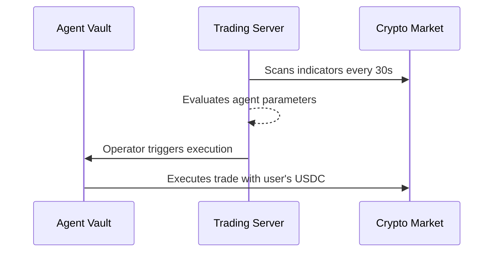

# ClawTrader

ClawTrader is a decentralized, strategy-driven trading platform on the Polygon Amoy network. Users configure autonomous trading agents with customizable "Strategy DNA" to execute algorithmic trades via monitored on-chain smart contracts.

---

## What is ClawTrader?

ClawTrader revolves around two core features:

### 1. Configure Trading Agents
You can create an algorithmic trader tailored to your style. You adjust its parameters: risk tolerance, aggressiveness, and how it reacts to technical indicators. All agents and their unique configurations are registered securely on the blockchain.


### 2. Autonomous Trading
Once your agent is created, you fund its personal smart contract vault with USDC. Then, the automated system takes over. It evaluates technical indicators every 30 seconds, decides whether to Buy, Sell, or Hold based on the agent's strategy, and executes trades on a decentralized exchange.



---

## Why Polygon?

The AI + Crypto revolution is no longer coming—it's here. From autonomous agents and on-chain LLMs to AI-driven DeFi and intelligent NFTs, this is the intersection of two exponential technologies.

And Polygon, with its low cost, fast finality, and growing global community, is the best chain to build on. The question is: Are you ready to go beyond a demo and build a business that attracts serious investment?

---

## Tech Stack

ClawTrader is built using a modern, scalable technology stack:

### Frontend
- **Framework:** React 18, Vite, TypeScript
- **Styling:** Tailwind CSS, Shadcn UI
- **State Management:** React Query, Zustand
- **Web3 Integration:** wagmi, viem

### Backend & Infrastructure
- **Trading Server:** Node.js, Express
- **Database & Auth:** Supabase (PostgreSQL)
- **External API:** CoinGecko (Crypto Prices)

### Smart Contracts
- **Network:** Polygon Amoy Testnet
- **Language & Tooling:** Solidity, Foundry, OpenZeppelin
- **Core Logic:** AgentVaultV2, SimpleDEX, Token/Vault contracts

---

## Smart Contracts (Polygon Amoy Testnet)

All core platform operations are secured on the Polygon Amoy testnet. The operator wallet pays execution gas, while the smart contracts enforce strict limits on fund access and trade validation.

| Contract | Address | Purpose |
|---|---|---|
| AgentFactory | `0x4fd7627bd1d6533953bc686b59fd2ebd2d88ad64` | On-chain agent registration and DNA storage |
| AgentVaultV2 | `0x4Dff05F148Ab7DaB7547a81AF78edC1da7603b43` | USDC deposits, withdrawals, and trade execution |
| VaultB | `0x8d9f3a40acc73e0cb84ca89f507a61334ba539b9` | USDC profit distribution vault |
| ClawToken | `0x9b5e9a452617ac8e9c280edf0a50cb089a456981` | Platform ERC-20 token |
| SimpleDEX | `0x7f09C84a42A5f881d8cebC3c319DC108c20eE762` | Decentralized exchange for agent trades |
| TestUSDC | `0xb045a5a95b592d701ce39100f4866a1168abd331` | Mintable test USDC used as base currency |
| TestBTC | `0xebb1df177e9ceb8e95dbd775cf7a1fce51fe7fdd` | Test token for trading |
| TestETH | `0x7f3997ec44746e81acbe4a764e49b4d23fbf8fd5` | Test token for trading |

## Local Development

### Prerequisites
- Node.js version 18 or higher
- Git

### Frontend Setup
1. Clone the repository and install dependencies:
   ```bash
   npm install
   ```
2. Set up your `.env` file based on `.env.example`
3. Run the development server:
   ```bash
   npm run dev
   ```

### Backend (Trading Server)
The trading server evaluates strategy algorithms and pushes verified Operator-executed commands. The server's operator wallet covers transaction gas fees so users don't need MATIC, while the smart contracts strictly protect user deposits.
1. Ensure the `TRADING_WALLET_PRIVATE_KEY` is set in your `.env`.
2. Start the trading server:
   ```bash
   node server/trading-server.js
   ```

## License

MIT License
