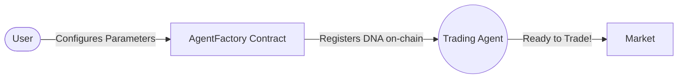
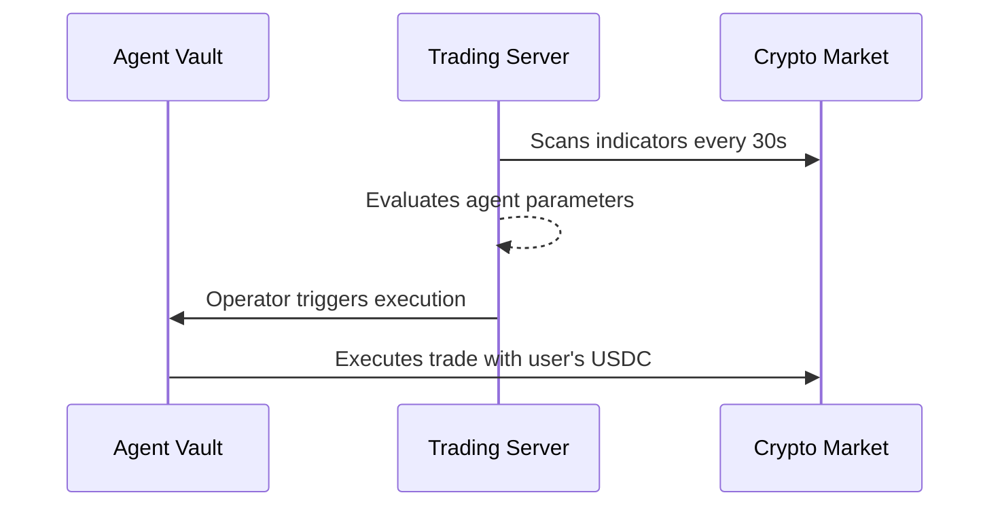

# ClawTrader – Autonomous Trading Agents on Polygon

ClawTrader is a decentralized, strategy-driven trading platform on the Polygon Amoy network. Users configure autonomous trading agents with customizable "Strategy DNA" to execute algorithmic trades via monitored on-chain smart contracts.

---

## What is ClawTrader?

ClawTrader revolves around two core features:

### 1. Configure Trading Agents
You can create an algorithmic trader tailored to your style. You adjust its parameters: risk tolerance, aggressiveness, and how it reacts to technical indicators. All agents and their unique configurations are registered securely on the blockchain.



### 2. Autonomous Strategy Execution
Once an agent is created, the user funds its dedicated smart contract vault with USDC. From that point onward, strategy execution is automated.

An off-chain trading server periodically evaluates market data and technical indicators (every 30 seconds) against the agent’s predefined strategy parameters. Based on this evaluation, the server determines whether a Buy, Sell, or Hold action is permitted.

If an execution condition is met, a restricted operator wallet submits the trade transaction to the agent’s on-chain vault. The smart contract validates the request and executes the trade on a decentralized exchange using the vault’s funds.

At no point does the trading server custody user funds. All assets remain locked inside user-owned smart contract vaults, and execution is strictly limited by on-chain rules.

All tradings are performed using USDC as the base currency. TBTC,TETH,TSOL are traded as an intermediate asset, but profits are always realized and withdrawable in USDC.



---

## Why Polygon

ClawTrader was built on Polygon because it offers the practical infrastructure required to run autonomous, on-chain systems at scale.

Autonomous trading agents require frequent execution, fast finality, and predictable transaction costs. Polygon provides low fees and rapid confirmation times, making it suitable for continuous agent execution without degrading user experience.

Beyond performance, Polygon has a mature developer ecosystem, strong tooling support, and an active community focused on real-world adoption. This makes it an ideal environment not just for experimentation, but for building production ready decentralized applications.

ClawTrader is designed to go beyond a demo by combining autonomous execution, transparent on-chain custody, and scalable infrastructure capabilities that are difficult to achieve on higher cost networks.

---

## Tech Stack

ClawTrader is built using a modern, scalable technology stack:

### Frontend
- **Framework:** React 18, Vite, TypeScript
- **Styling:** Tailwind CSS, Shadcn UI
- **State Management:** React Query, Zustand
- **Web3 Integration:** wagmi, viem

Backend & Infrastructure
- Trading Server: Node.js, Express
- Database: Neon (Serverless PostgreSQL)
- Database Access: Supabase (Auth & edge access)
- Blockchain Data: Etherscan / Polygonscan API
- External Market Data: CoinGecko (Crypto Prices)

### Smart Contracts
- **Network:** Polygon Amoy Testnet
- **Language & Tooling:** Solidity, Foundry, OpenZeppelin
- **Core Logic:** AgentVaultV2, SimpleDEX, Token/Vault contracts

---

## Smart Contracts (Polygon Amoy Testnet)

All core platform operations are secured on the Polygon Amoy testnet. The operator wallet pays execution gas, while the smart contracts enforce strict limits on fund access and trade validation.

| Contract | Address | Purpose |
|---|---|---|
| AgentFactory | `0x4fd7627bd1d6533953bc686b59fd2ebd2d88ad64` | On-chain agent registration and DNA storage |
| AgentVaultV2 | `0x4Dff05F148Ab7DaB7547a81AF78edC1da7603b43` | USDC deposits, withdrawals, and trade execution |
| VaultB | `0x8d9f3a40acc73e0cb84ca89f507a61334ba539b9` | USDC profit distribution vault |
| ClawToken | `0x9b5e9a452617ac8e9c280edf0a50cb089a456981` | Platform ERC-20 token |
| SimpleDEX | `0x7f09C84a42A5f881d8cebC3c319DC108c20eE762` | Decentralized exchange for agent trades |
| USDC | `0xb045a5a95b592d701ce39100f4866a1168abd331` | Mintable test USDC used as base currency |
| TBTC | `0xebb1df177e9ceb8e95dbd775cf7a1fce51fe7fdd` | Test token for trading |
| TETH | `0x7f3997ec44746e81acbe4a764e49b4d23fbf8fd5` | Test token for trading |
| TSOL | `0x7bb46e04138aa7b97a731b86899c9b04a5fc964c` | Test token for trading |

## Local Development

### Prerequisites
- Node.js version 18 or higher
- Git

The following environment variables are required:

- TRADING_WALLET_PRIVATE_KEY
- DATABASE_URL (Neon PostgreSQL connection string)
- ETHERSCAN_API_KEY


### Frontend Setup
1. Clone the repository and install dependencies:
   ```bash
   npm install
   ```
2. Set up your `.env` file based on `.env.example`
3. Run the development server:
   ```bash
   npm run dev
   ```

## Trading Server Overview

The trading server is responsible for evaluating predefined strategy rules and technical indicators off-chain and submitting execution transactions to smart contracts.

It does **not** custody user funds. All assets remain locked inside user-owned on-chain vaults.  
The server operates through a restricted operator wallet that can only execute approved actions validated by the agent vault contracts.

The trading server:
- Evaluates strategy rules at fixed intervals
- Determines whether Buy, Sell, or Hold conditions are met
- Submits execution transactions to agent vault contracts
- Pays gas fees on behalf of users
- Tracks execution status using RPC and Polygonscan APIs

The trading server cannot withdraw user funds or bypass on-chain limits enforced by the smart contracts.
1. Ensure the `TRADING_WALLET_PRIVATE_KEY` is set in your `.env`.
2. Start the trading server:
   ```bash
   node server/trading-server.js
   ```

### Infrastructure Notes

ClawTrader uses **Neon**, a serverless PostgreSQL database, for fast and scalable agent indexing, trade history storage, and UI synchronization.

Blockchain reads (such as transaction status and confirmations) are supported via the **Etherscan / Polygonscan API**, complementing direct RPC calls for reliability and observability.

## License

This project is licensed under the MIT License.
