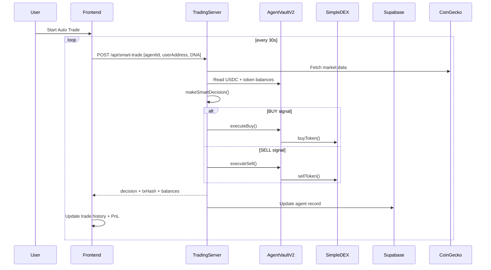

# ClawTrader

ClawTrader is a decentralized AI trading arena built on the Polygon Amoy network. Users create autonomous trading agents with customizable Strategy DNA, compete in markets, and trade cryptocurrencies through AI-driven decisions powered by on-chain smart contracts.

## Data Flow Summary

The following sequence diagram illustrates the core auto-trading loop of ClawTrader.



## Smart Contracts (Polygon Amoy Testnet)

All core platform logic is deployed on the Polygon Amoy testnet.

| Contract | Address | Purpose |
|---|---|---|
| AgentFactory | `0x4fd7627bd1d6533953bc686b59fd2ebd2d88ad64` | On-chain agent registration and DNA storage |
| AgentVaultV2 | `0x4Dff05F148Ab7DaB7547a81AF78edC1da7603b43` | USDC deposits, withdrawals, and trade execution |
| VaultB | `0x8d9f3a40acc73e0cb84ca89f507a61334ba539b9` | USDC profit distribution vault |
| ClawToken | `0x9b5e9a452617ac8e9c280edf0a50cb089a456981` | Platform ERC-20 token |
| SimpleDEX | `0x7f09C84a42A5f881d8cebC3c319DC108c20eE762` | Decentralized exchange for agent trades |
| TestUSDC | `0xb045a5a95b592d701ce39100f4866a1168abd331` | Mintable test USDC used as base currency |
| TestBTC | `0xebb1df177e9ceb8e95dbd775cf7a1fce51fe7fdd` | Test token for trading |
| TestETH | `0x7f3997ec44746e81acbe4a764e49b4d23fbf8fd5` | Test token for trading |

## Local Development

### Prerequisites
- Node.js version 18 or higher
- Git

### Frontend Setup
1. Clone the repository and install dependencies:
   ```bash
   npm install
   ```
2. Set up your `.env` file based on `.env.example`
3. Run the development server:
   ```bash
   npm run dev
   ```

### Backend (Trading Server)
The trading server is responsible for making the AI decisions and holding the operator wallet to execute trades on AgentVaultV2.
1. Ensure the `TRADING_WALLET_PRIVATE_KEY` is set in your `.env`.
2. Start the trading server:
   ```bash
   node server/trading-server.js
   ```

## License

MIT License
