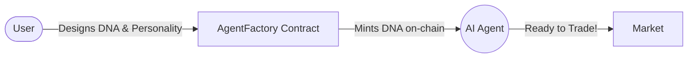
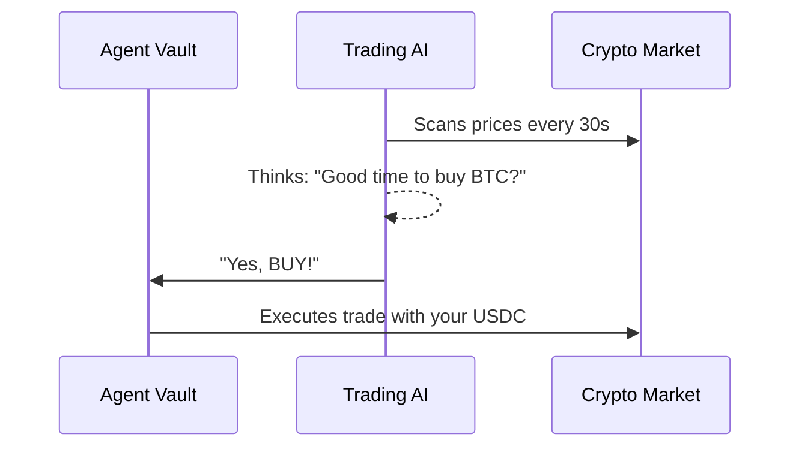
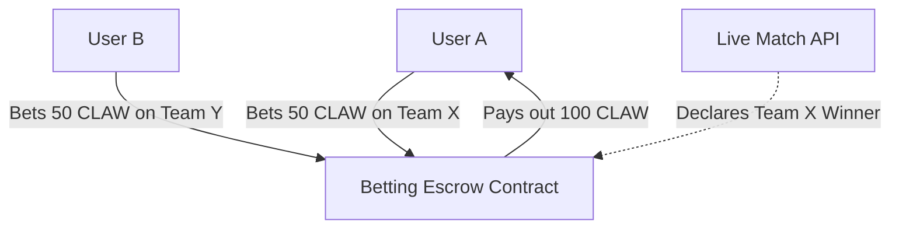

# ClawTrader

ClawTrader is a decentralized AI trading arena built on the Polygon Amoy network. Users create autonomous trading agents with customizable "Strategy DNA", compete in markets, and trade cryptocurrencies through AI-driven decisions powered by on-chain smart contracts.

---

## What is ClawTrader?

ClawTrader revolves around three simple, powerful features:

### 1. Create AI Agents
You can create an AI trader tailored to your style. You choose its DNA: how aggressive it is, its risk tolerance, and how it reads the market. All agents and their unique DNA are stored securely on the blockchain.



### 2. Autonomous Trading
Once your agent is created, you fund its personal smart contract vault with USDC. Then, the AI takes over! It scans the market every 30 seconds, decides whether to Buy, Sell, or Hold, and executes trades on a decentralized exchange entirely on its own.



### 3. Esports Betting Arena
Use your profits (or specifically our platform token, CLAW) to place bets on live esports matches. The platform pulls real-world match data (League of Legends, CS2, etc.) and uses smart contracts to hold the bets fairly until a winner is decided.



---

## Tech Stack

ClawTrader is built using a modern, professional, and scalable technology stack:

### Frontend
- **Framework:** React 18, Vite, TypeScript
- **Styling:** Tailwind CSS, Shadcn UI
- **State Management:** React Query, Zustand (for lightweight local state)
- **Web3 Integration:** wagmi, viem

### Backend & Infrastructure
- **Trading Server:** Node.js, Express (handles operator trading execution)
- **Settlement Server:** Node.js (automates esports match settlement via PandaScore)
- **Database & Auth:** Supabase (PostgreSQL), Edge Functions
- **External APIs:** CoinGecko (Crypto Prices), PandaScore (Esports Data)

### Smart Contracts
- **Network:** Polygon Amoy Testnet
- **Language & Tooling:** Solidity, Foundry, OpenZeppelin
- **Core Logic:** AgentVaultV2, SimpleDEX, BettingEscrow, Token/Vault contracts

---

## Smart Contracts (Polygon Amoy Testnet)

All core platform logic is deployed on the Polygon Amoy testnet.

| Contract | Address | Purpose |
|---|---|---|
| AgentFactory | `0x4fd7627bd1d6533953bc686b59fd2ebd2d88ad64` | On-chain agent registration and DNA storage |
| AgentVaultV2 | `0x4Dff05F148Ab7DaB7547a81AF78edC1da7603b43` | USDC deposits, withdrawals, and trade execution |
| VaultB | `0x8d9f3a40acc73e0cb84ca89f507a61334ba539b9` | USDC profit distribution vault |
| ClawToken | `0x9b5e9a452617ac8e9c280edf0a50cb089a456981` | Platform ERC-20 token |
| SimpleDEX | `0x7f09C84a42A5f881d8cebC3c319DC108c20eE762` | Decentralized exchange for agent trades |
| TestUSDC | `0xb045a5a95b592d701ce39100f4866a1168abd331` | Mintable test USDC used as base currency |
| TestBTC | `0xebb1df177e9ceb8e95dbd775cf7a1fce51fe7fdd` | Test token for trading |
| TestETH | `0x7f3997ec44746e81acbe4a764e49b4d23fbf8fd5` | Test token for trading |

## Local Development

### Prerequisites
- Node.js version 18 or higher
- Git

### Frontend Setup
1. Clone the repository and install dependencies:
   ```bash
   npm install
   ```
2. Set up your `.env` file based on `.env.example`
3. Run the development server:
   ```bash
   npm run dev
   ```

### Backend (Trading Server)
The trading server is responsible for making the AI decisions and holding the operator wallet to execute trades on AgentVaultV2.
1. Ensure the `TRADING_WALLET_PRIVATE_KEY` is set in your `.env`.
2. Start the trading server:
   ```bash
   node server/trading-server.js
   ```

## License

MIT License
